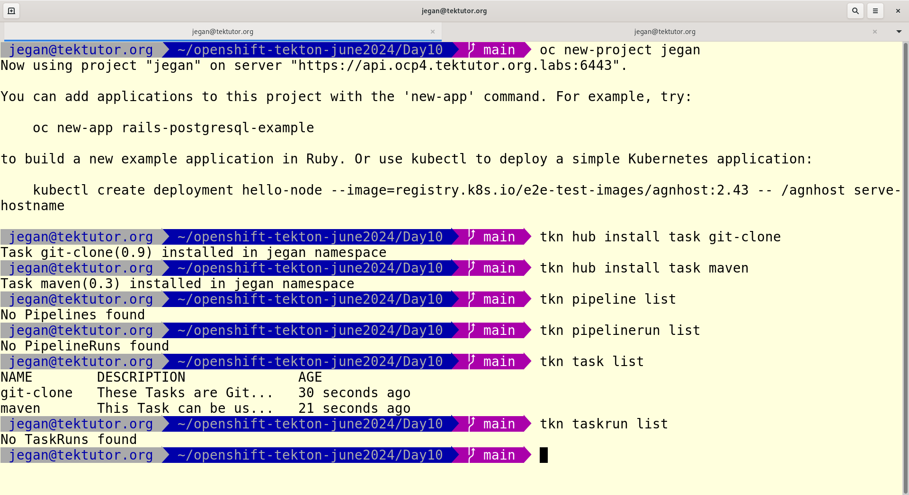
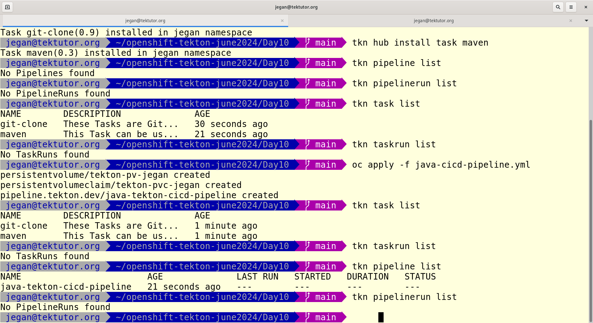
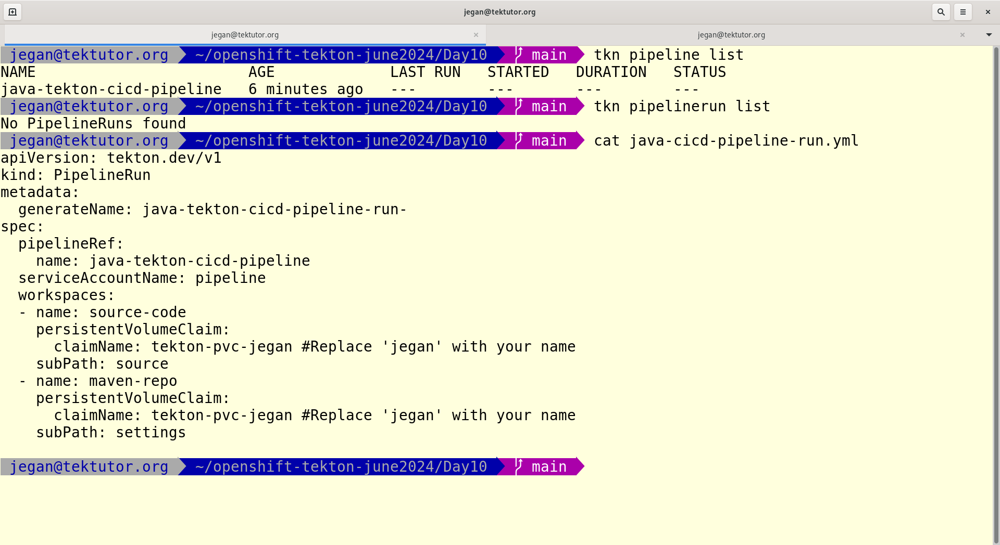
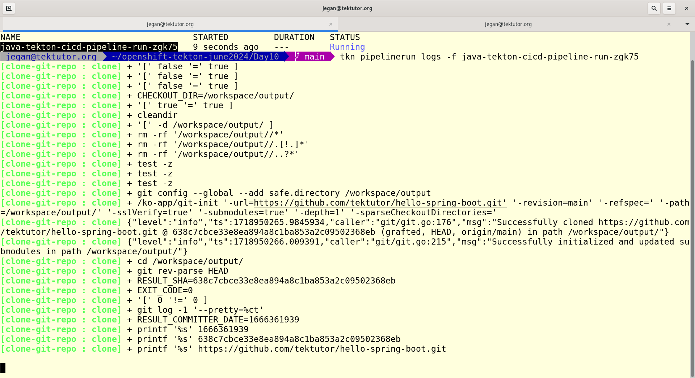
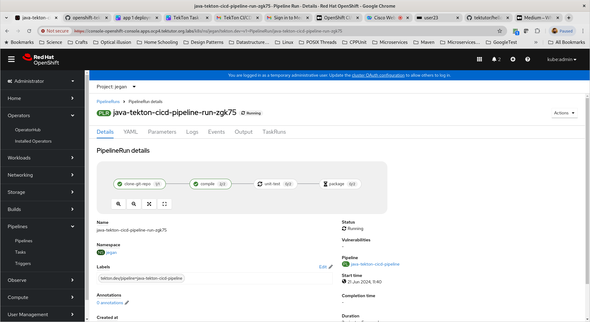
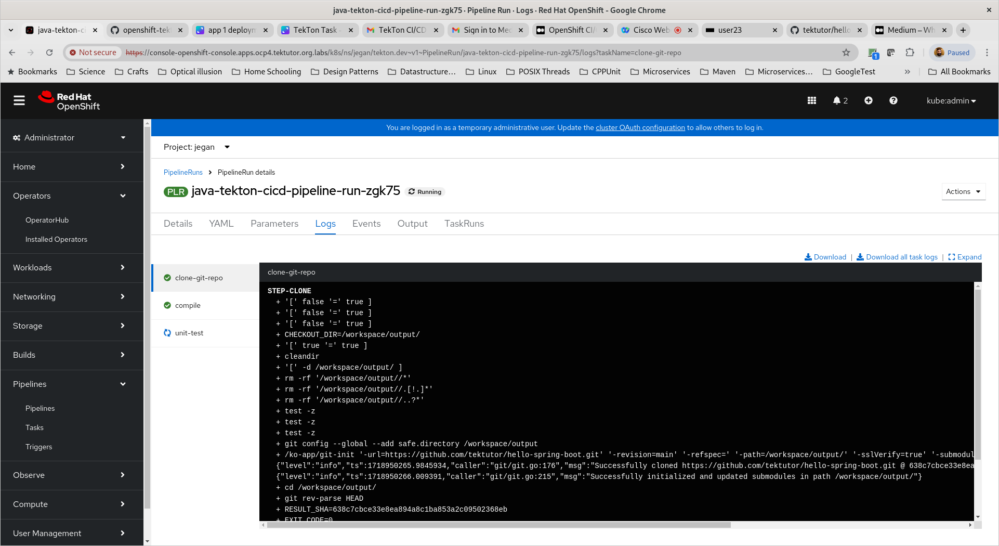
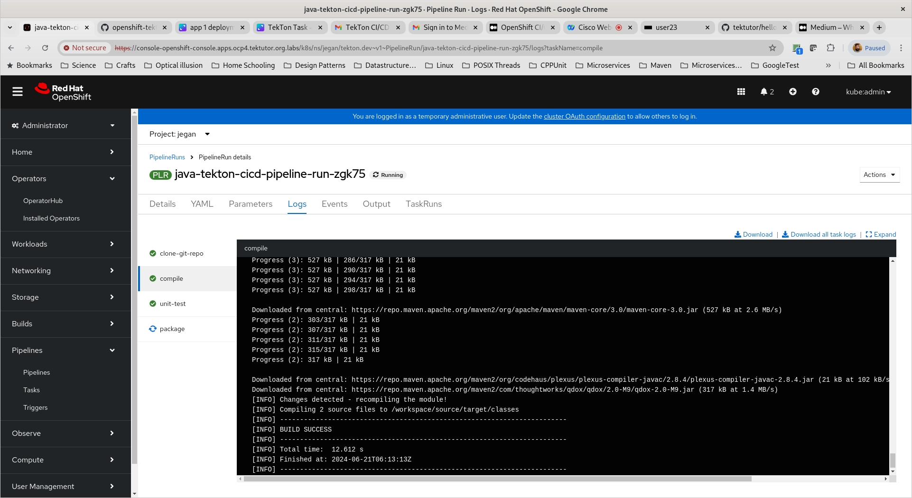
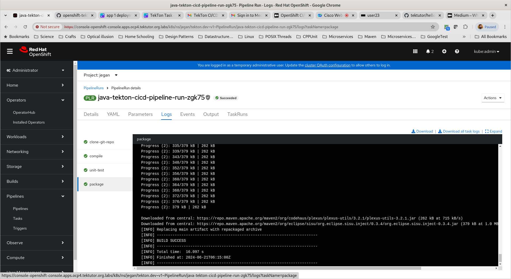
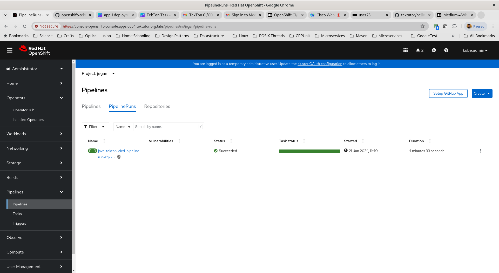

# Day 10

## Reference
You may check my medium blog about CI/CD with Tekton on Openshift
<pre>
https://medium.com/tektutor/openshift-ci-cd-with-tekton-faa88ba45656  
</pre>

## Lab - Creating a declarative CI/CD Pipeline using TekTon knative Framework in Red Hat Openshift
```
cd ~/openshift-tekton-june2024
git pull
cd Day10
cat java-cicd-pipeline.yml

tkn task list
tkn taskrun list
tkn pipeline list
tkn pipelinerun list

oc apply -c java-cicd-pipeline.yml

tkn task list
tkn taskrun list
tkn pipeline list
tkn pipelinerun list

cat java-cicd-pipeline-run.yml
oc create -f java-cicd-pipeline-run.yml
tkn pipelinerun list --showlog
```

Expected output











