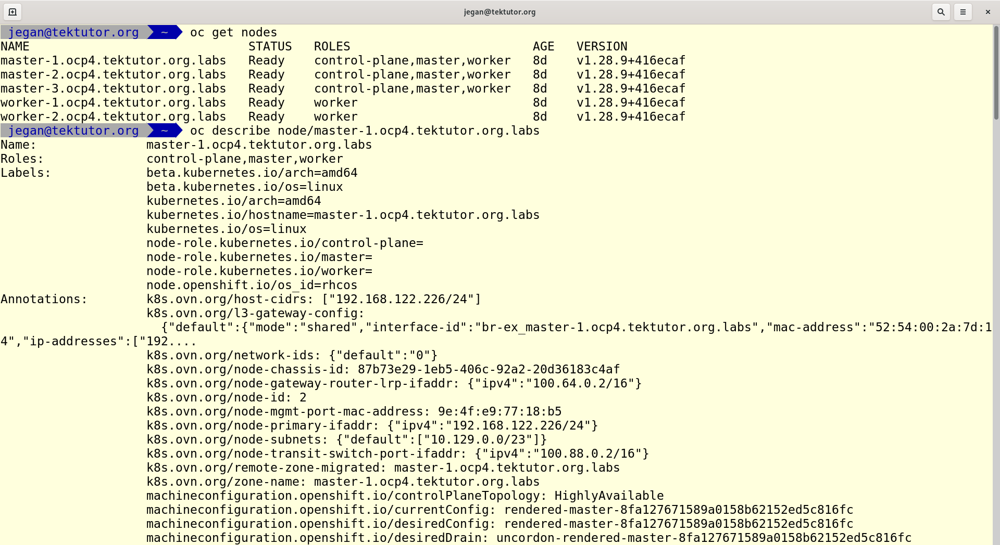
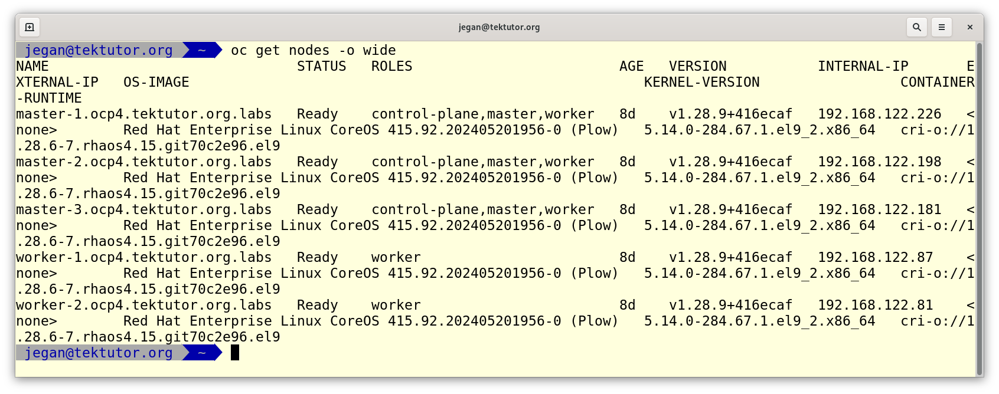

# Day 2

## Info - SOLID Design Principles
S - Single Responsibility Principle (SRP)
O - Open Closed Principle (OCP)
L - Liskov Substitution Principle (LSP)
I - Interface Seggration Principle
D - Dependency Injection or Dependency Inversion or Inversion of Control (IOC)

## Lab - Finding more details about a node
```
oc get nodes
oc describe node/master-1.ocp4.tektutor.org.labs
```

Expected output


## Lab - Editing a node (don't modify anything)
```
oc get nodes
oc edit node/worker-1.ocp4.tektutor.org.labs
```
Expected output


## Lab - Using wide mode to find node IP and OS installed
```
oc get nodes -o wide
```

Expected output


## Lab - Login to openshift from commandline
```
cat ~/openshift.txt
oc login -u kubeadmin
```
Expected output


## Lab - OpenShift Webconsole login
```
cat ~/openshift.txt
```

Open your webconsole link from Google Chrome web browser on the CentOS Lab Machine


