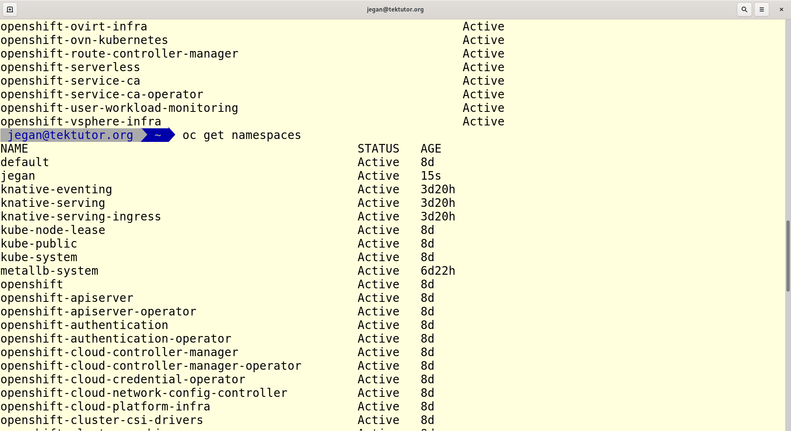

# Day 2

## Info - SOLID Design Principles
S - Single Responsibility Principle (SRP)
O - Open Closed Principle (OCP)
L - Liskov Substitution Principle (LSP)
I - Interface Seggration Principle
D - Dependency Injection or Dependency Inversion or Inversion of Control (IOC)

## Lab - Finding more details about a node
```
oc get nodes
oc describe node/master-1.ocp4.tektutor.org.labs
```

Expected output


## Lab - Editing a node (don't modify anything)
```
oc get nodes
oc edit node/worker-1.ocp4.tektutor.org.labs
```
Expected output


## Lab - Using wide mode to find node IP and OS installed
```
oc get nodes -o wide
```

Expected output


## Lab - Login to openshift from commandline
```
cat ~/openshift.txt
oc login -u kubeadmin
```
Expected output


## Lab - OpenShift Webconsole login
```
cat ~/openshift.txt
```

Open your webconsole link from Google Chrome web browser on the CentOS Lab Machine


## Lab - Create a new project

Replace 'jegan' with your name
```
oc new-project jegan
```

Listing the projects
```
oc get projects
oc get project
oc get namespaces
oc get namespace
oc get ns
```

Expected output



## Lab - Finding the currently project and switching between projects
```
oc project
oc project default
oc project
oc project jegan
```

Expected output


## Lab - Deploying your first application
nginx is a web server image that will be downloaded from Docker Hub Remote Registry by Openshift
```
oc create deployment nginx --image=nginx:latest
```

In the above command, nginx is the user-defined deployment name and nginx:latest is the docker image that will be downloaded from Docker Hub.

Listing the deployments
```
oc get deployments
oc get deployment
oc get deploy
```

Listing the replicasets
```
oc get replicasets
oc get replicaset
oc get rs
```

Listing the pods
```
oc get pods
oc get pod
oc get po
```

Expected output


Troubleshooting - checking the pod logs
```
oc get po
oc logs nginx-56fcf95486-dmzxk
```

Expected output


## Lab - Deleting nginx deployment
```
oc get deploy
oc delete deploy/nginx
oc get deploy,rs,po
```

Expected output

