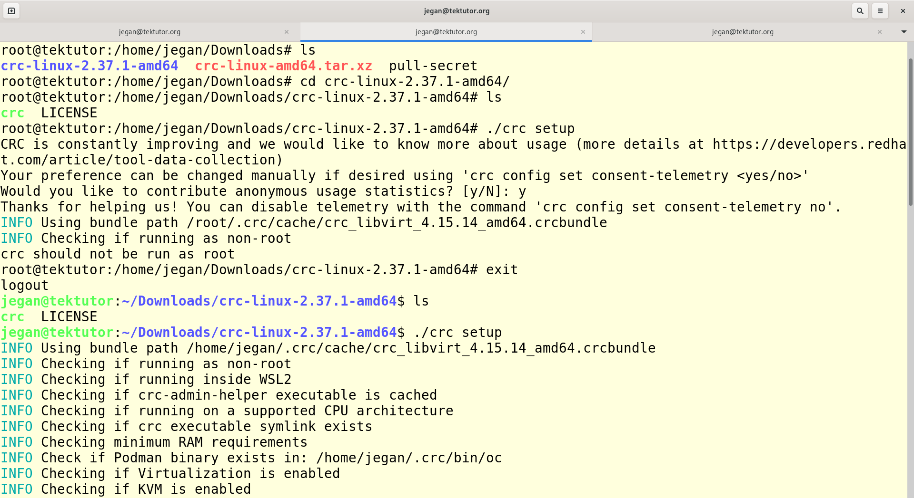
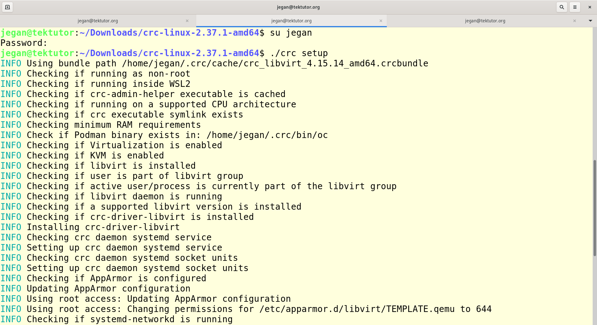
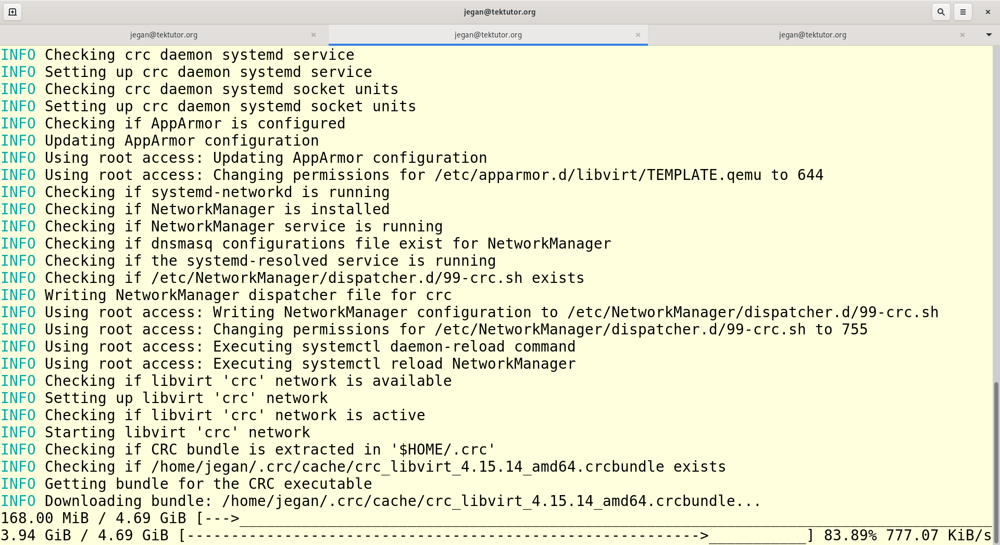

# Day 5

## Demo - Installing Openshift on your laptop/desktop for your personal learning ( Please don't try this in our lab setup )
<pre>
- You need to create a free developer account in redhat developer portal
- Login and download Code Ready Container compressed file as per your OS ( Windows, Mac or Linux )
- Extract the compressed file
- Execute 'crc setup'
- Execute 'crc start'
</pre>

Expected output

## Info - Kubernetes/Openshift Operators
<pre>
- Operator a package of many Custom Resources and Custom Controller  
- Kubernetes allows us to extend the Kubernetes API by adding Custom Resource Definitions
- Using Custom Resource Definitions(CRDs), we can add new Resources to Kubernetes/Openshift
- In order to manage the Custom Resource, we also have to supply a Custom Controller
- In Openshift/Kubernetes, 
  - the Deployment Controller manages Deployment Resource
  - the ReplicaSet Controller manages ReplicaSet Resource
</pre>

