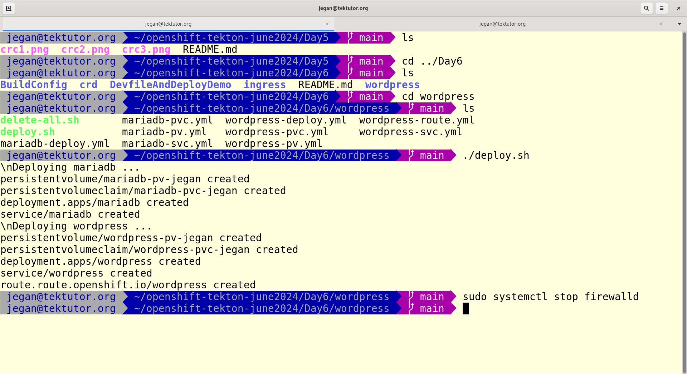
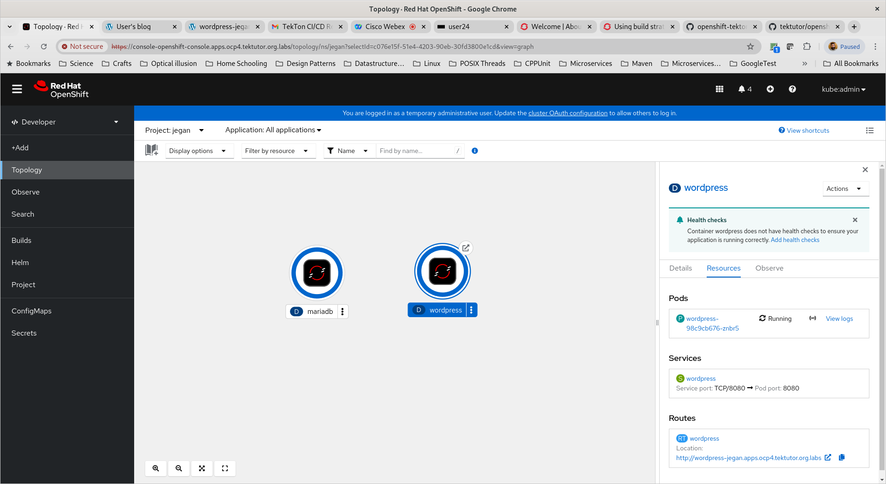
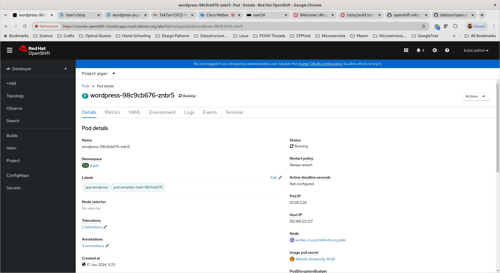
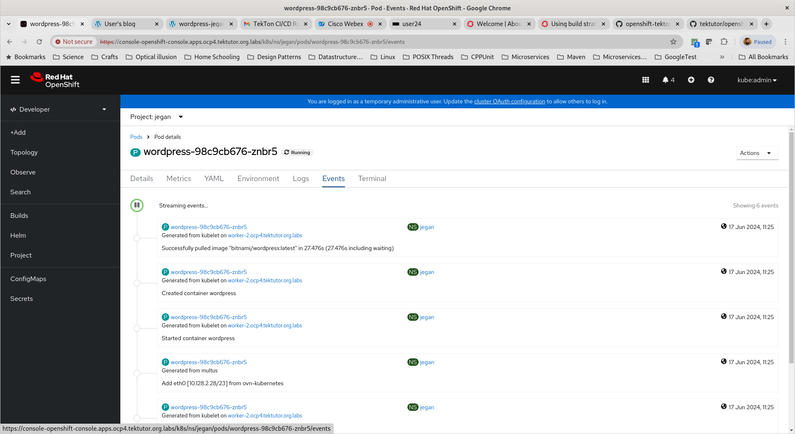
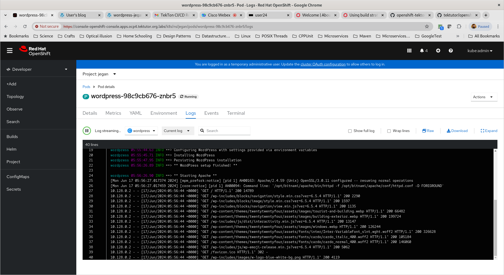
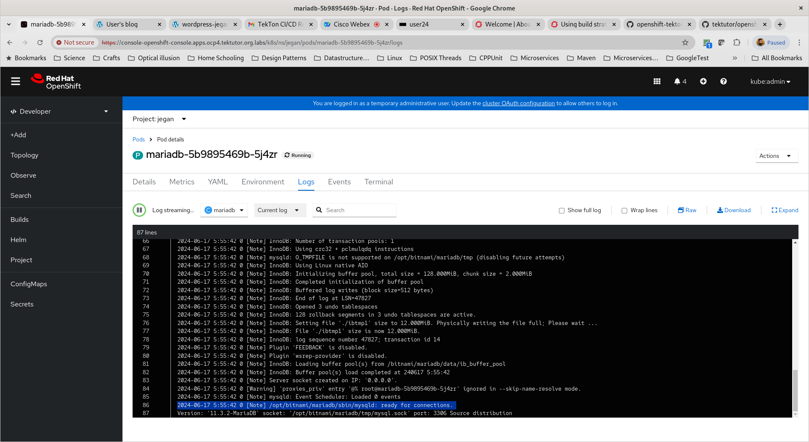
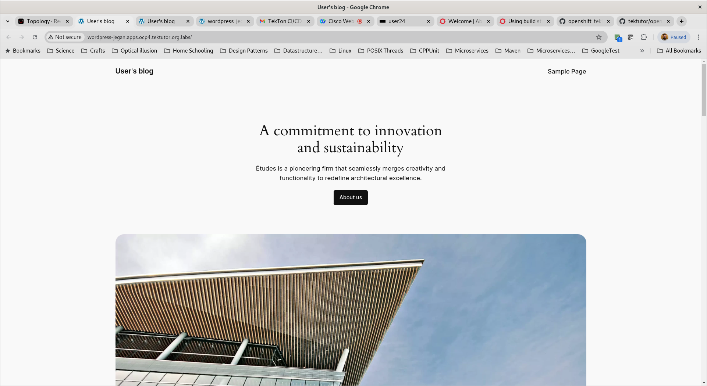

# Day 6

## Info - What is Ingress?
<pre>
- routing/forwarding rules
- Ingress is not a service
- We can declaratively create ingress rules, which are retreived by Ingress Controller, which then configures the load balancer with the forwarding rules we listing in the ingress
- For Ingress to work, we need the below
  - Ingress ( rules )
  - Ingress Controller
  - Load Balancer
</pre>

## Info - What is Ingress Controller?
- Ingress Controller is Controller like Deployment Controller, ReplicaSet Controller
- Ingress Controller keeps an eye on every new Ingress created in any project namespace
- Ingress Controller monitors any change done to existing Ingress resources under any project namespace
- Ingress Controller also will monitor when Ingress is deleted in any project namespace
- Ingress Controller picks the rules we mentioned in the Ingress resource and configures the load balancer accordingly
- There are two popular ingress controllers
  - Nginx Ingress Controller
  - HAProxy Ingress Controller
- In our lab setup, we are using HAProxy Load Balancer, hence we need to use HAProxy Ingress Controller

## Info - Deployment vs DeploymentConfigs

## Info - ReplicationController vs ReplicaSet

## Info - NodePort vs Route

## Info - Ingress vs Route


## Lab - Creating your own Custom Resource in Openshift
```
cd ~/openshift-tekton-june2024
git pull
cd Day6/crd

oc get trainings
oc get training
oc get train

oc apply -f training-crd.yml

oc get trainings
oc get training
oc get train

oc apply -f devops-training.yml
oc apply -f openshift-training.yml

oc get trainings
oc get training
oc get train
```

## Lab - Deploying wodpress & mariadb multi-pod application

Before deploy the wordpress and mariadb, you need to modify the mariadb-pv.yml, mariadb-pvc.yml, mariadb-deploy.yml, wordpress-pv.yml, wordpress-pvc.yml and wordpress-deploy.yml with your linux server IP and replace 'jegan' with your name.

```
cd ~/openshift-tektutor-june2024.git
git pull
cd Day6/wordpress
./deploy.sh
```

Expected output








