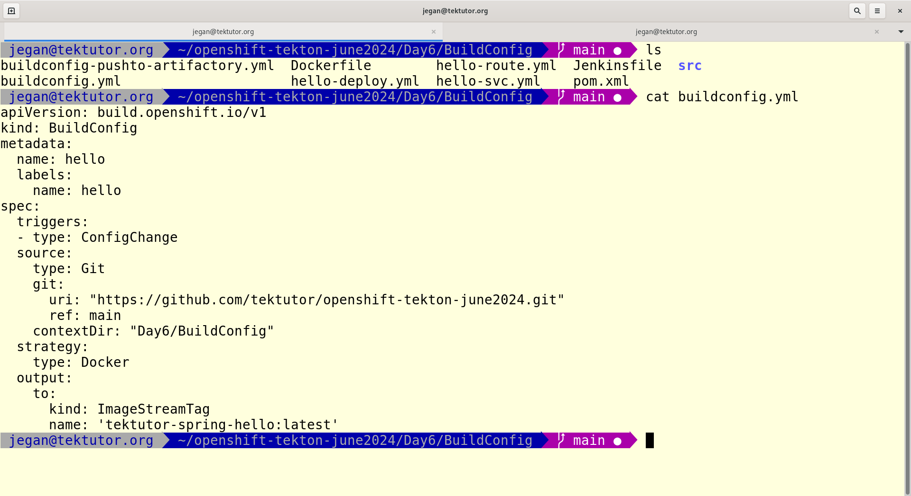
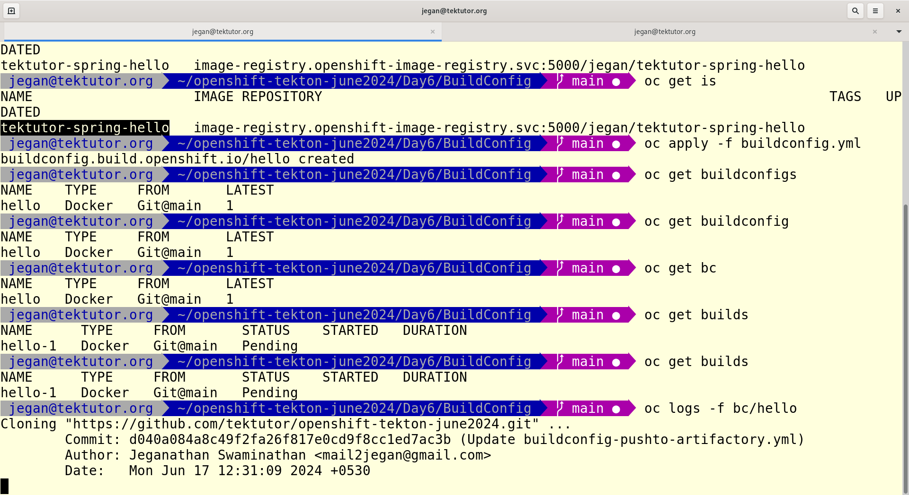
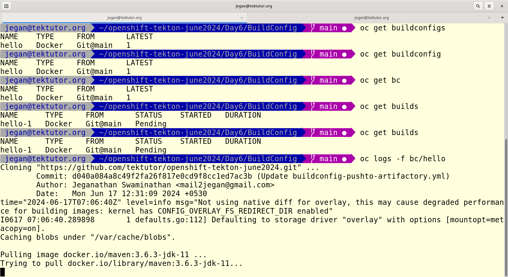
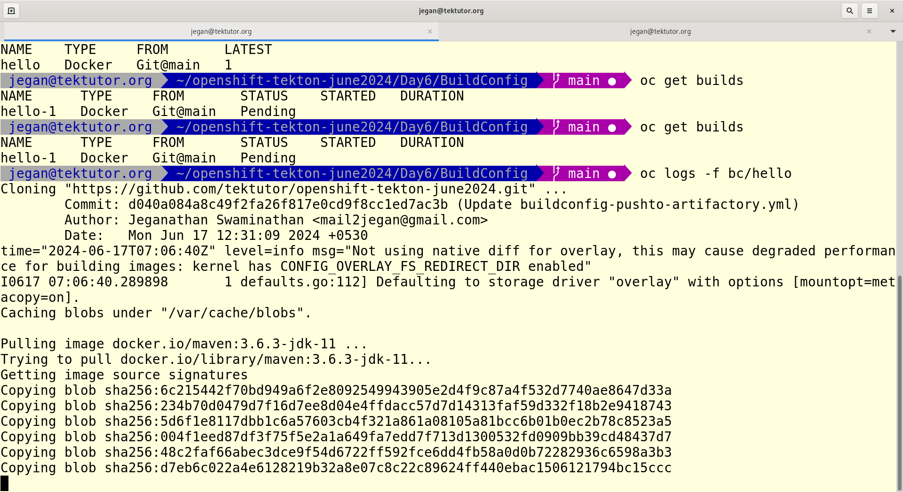
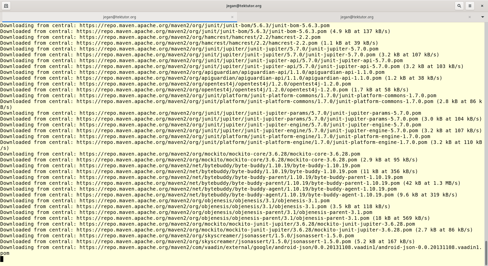
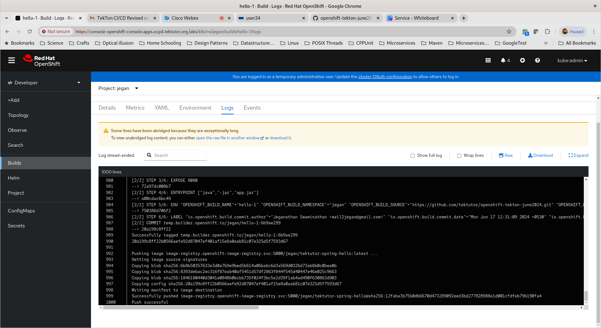
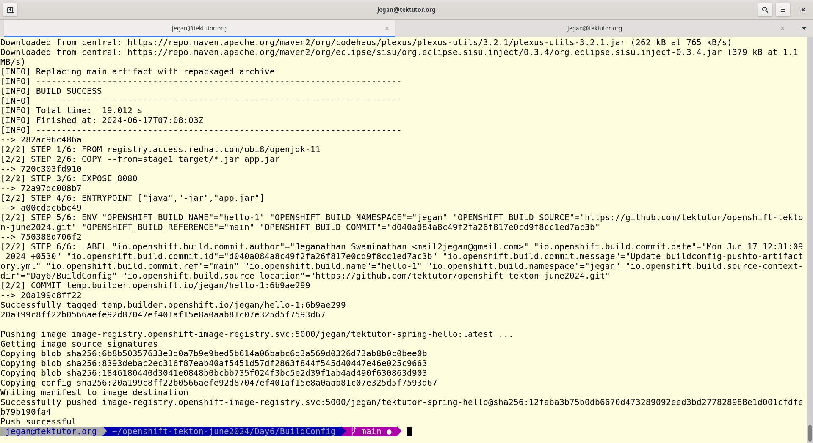
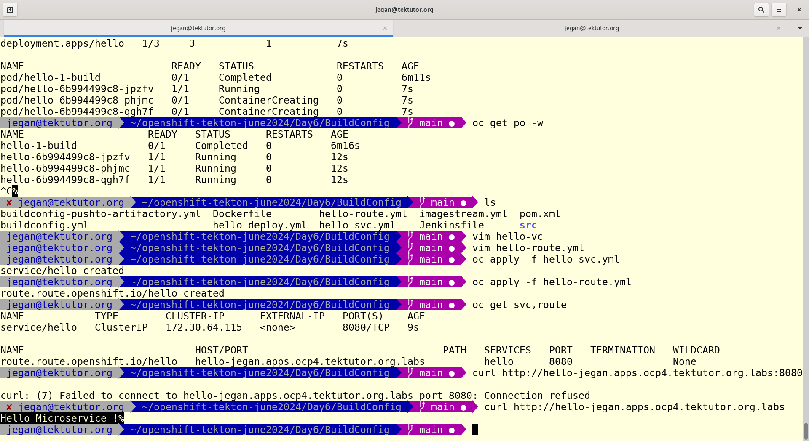
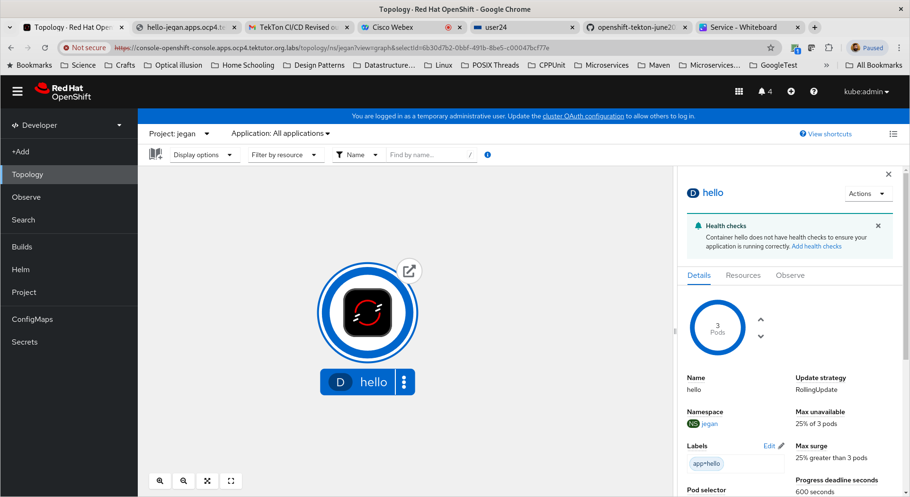
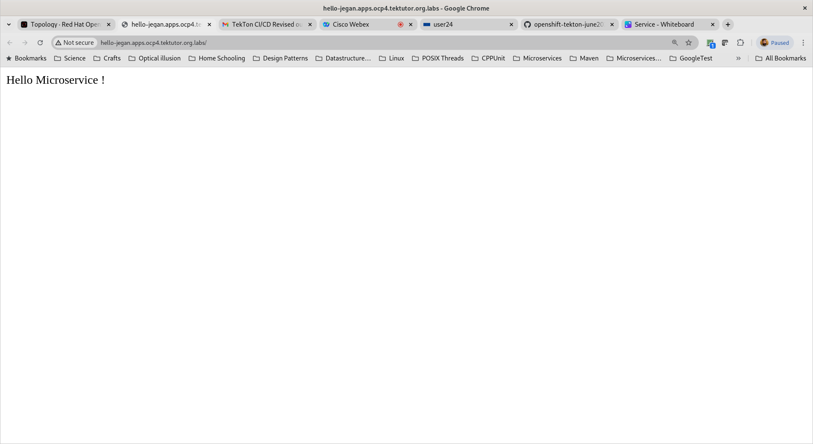

# Day 6

## Info - Openshift Service
<pre>
- represents a groups of load-balanced pods from the same deployment
- service will forward the call to any one of the Pod within a single deployment
</pre>  

## Info - What is Ingress?
<pre>
- routing/forwarding rules
- Ingress helps in forwarding the calls to multiple different services pointing to different deployments
- Ingress is not a service
- We can declaratively create ingress rules, which are retreived by Ingress Controller, which then configures the load balancer with the forwarding rules we listing in the ingress
- For Ingress to work, we need the below
  - Ingress ( rules )
  - Ingress Controller
  - Load Balancer
</pre>

## Info - What is Ingress Controller?
- Ingress Controller is Controller like Deployment Controller, ReplicaSet Controller
- Ingress Controller keeps an eye on every new Ingress created in any project namespace
- Ingress Controller monitors any change done to existing Ingress resources under any project namespace
- Ingress Controller also will monitor when Ingress is deleted in any project namespace
- Ingress Controller picks the rules we mentioned in the Ingress resource and configures the load balancer accordingly
- There are two popular ingress controllers
  - Nginx Ingress Controller
  - HAProxy Ingress Controller
- In our lab setup, we are using HAProxy Load Balancer, hence we need to use HAProxy Ingress Controller

## Info - Deployment vs DeploymentConfigs

## Info - ReplicationController vs ReplicaSet

## Info - NodePort vs Route

## Info - Ingress vs Route


## Lab - Creating your own Custom Resource in Openshift
```
cd ~/openshift-tekton-june2024
git pull
cd Day6/crd

oc get trainings
oc get training
oc get train

oc apply -f training-crd.yml

oc get trainings
oc get training
oc get train

oc apply -f devops-training.yml
oc apply -f openshift-training.yml

oc get trainings
oc get training
oc get train
```

## Lab - Deploying wodpress & mariadb multi-pod application

Before deploy the wordpress and mariadb, you need to modify the mariadb-pv.yml, mariadb-pvc.yml, mariadb-deploy.yml, wordpress-pv.yml, wordpress-pvc.yml and wordpress-deploy.yml with your linux server IP and replace 'jegan' with your name.

```
cd ~/openshift-tektutor-june2024.git
git pull
cd Day6/wordpress
./deploy.sh
```

Expected output


## Ingress
Let's create a nginx deployment
```
oc project
oc create deployment nginx --image=bitnami/nginx:latest --replicas=3
oc get deploy,rs,po
```

Let's create clusterip internal service for nginx deployment
```
oc expose deploy/nginx --port=8080
oc get svc
oc describe svc/nginx
```

Let's create a hello microservice deployment
```
oc project
oc create deployment hello --image=tektutor/spring-ms:1.0 --replicas=3
oc get deploy,rs,po
```

Let's create clusterip internal service for hello deployment
```
oc expose deploy/hello --port=8080
oc get svc
oc describe svc/hello
```

Now let's create the ingress
```
cd ~/openshift-tekton-june2024
git pull
cd Day6/ingress
cat ingress.yml
oc apply -f ingress.yml
oc get ingress
```

Access the different services using ingress url, to access nginx service
```
curl http://tektutor.apps.ocp4.tektutor.org.labs/nginx
```

Access the different services using ingress url, to access hello service
```
curl http://tektutor.apps.ocp4.tektutor.org.labs/hello
```

Expected output


## Lab - S2I using Docker strategy by using declarartive build config manifest file

First we need create the imagestream to store the image in openshift internal container registry
```
cd ~/openshift-tekton-june2024
git pull
cd Day6/buildconfig
cat imagestream.yml
oc apply -f imagestream.yml
oc get imagestreams
oc get imagestream
oc get is
```

Now, let's create the builconfig and start the build
```
cd ~/openshift-tekton-june2024
git pull
cd Day6/buildconfig
oc apply -f buildconfig.yml
oc get buildconfigs
oc get buildconfig
oc get bc
```

To check the build log, you may try this
```
oc logs -f bc/hello
```

Expected output












