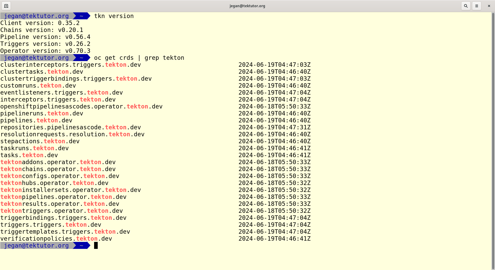
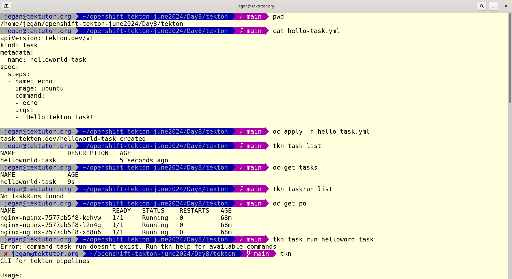
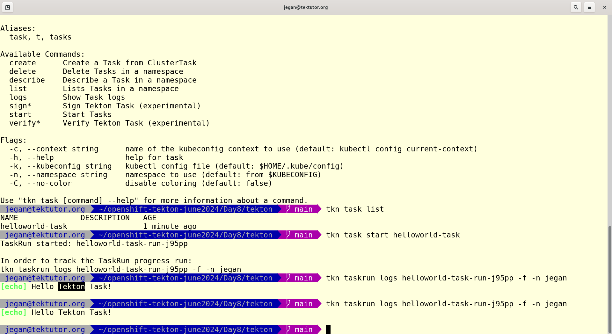

# Day 8


## Info - Tekton Jargons
<pre>
- Red Hat Pipeline operator installs Tekton Knative Serverless Pipeline Framework into openshift
- the operators also adds many Custom Resources like
  - Task
  - TaskRun
  - Pipeline
  - PipelineRun
  - PipelineResources
  - Catalog
  - Tekton Trigger
</pre>


## Info - What is a Step in Tekton Task?
<pre>
- Step is a Custom Resource added by Tekton in our openshift cluster using Custom Resource Definition(CRD)
- Each Step runs in a separate Container
- Steps can't be executed independed
- Steps always runs within a Tekton Task
</pre>

## Lab - Kindly check if you have tkn client installed
```
tkn version
oc get crds | grep tekton
```
Expected output



## Lab - Creating your first Tekton Task
```
cd ~/openshift-tekton-june2024
git pull
cd Day8/tekton/
pwd
cat hello-task.yml
oc apply -f hello-task.yml
tkn task list
oc get tasks
tkn taskrun list
oc get po
tkn task start helloworld-task
tkn taskrun logs helloworld-task-run-j95pp -f -n jegan
```
Expected output




## Info - What is a Tekton Task?
<pre>
- Custom Resource added by Red Hat Openshift Pipeline operator using CRD
- Task can be executed independently outside a Tekton Pipeline
- Task supports two scopes
  - Project scope
  - Cluster wide
- Each task contains one or more Steps
- Task is the smallest independent unit that can be deployed in Tekton under openshift
- Examples
  - A Task can be used to clone source code from GitHub
  - A Task can be used to build a container image, etc.,
  - A Task can be used to build application binary from source code
</pre>

## Info - What is Pipeline?
<pre>
- a Custom Resource added by Tekton in openshift cluster
- it is a collection of many Task executed in sequence or parallel
- results in an output based on your inputs given to CI/CD pipeline
- Examples
  - a First Task could clone your source code from your GitHub Repo
  - a Second Task could compile your application after the First Task clones the source code
  - a Third Task could run Unit tests on your compiled application binary if the Second Task succeeds
  - a Fourth Task could package the binaries if Third Task succeeds
  - a Fifth Task could deploy the binaries to JFrog Artifactory Server or Sonatype Nexus Server if the Fourth Task succeeds
  - a Sixth Task could run in parallel to Fifth Task to deploy the microservice to staging environment if Fourth Task succeeds
</pre>

## Info - TaskRun
<pre>
- is a Custom Resource added by Tekton
- Task can be thought of like a Class, while TaskRun is running instance of a Task
- TaskRun helps us supply Task arguments that are required for a Task to run
</pre>

## Info - PipelineRun
<pre>
- is a Custom resource added by Tekton
- Pipeline is the blueprint/specification of PipelineRun
- PipelineRun is the running instance of the Pipeline
- PipelineRun helps us provide the Pipeline arguments
</pre>

## Info - Tekton Trigger
<pre>
- is a component that allows Tekton Pipeline to detect events from variety of sources 
- it also helps detect code changes from GitHub, or any version control
- TekTon Triggers can invoke TaskRun and/or PipelineRun with the parameters retrieved from events
- Tekton Triggers is an extension to run TekTon Pipeline
- Example
  - helps in triggering a Tekton CI/CD pipeline based on code commit in GitHub repo or similar version controls
</pre>

# Info - Tekton Catalog?
<pre>
- Reusable Task and Pipeline Resources  
</pre>

# Info - Tekton Dashboard
<pre>
- web based Dashbord or console for Tekton
- Openshift integrated the Tekton Dashboard within openshift webconsole
- but it is also possible to access outside cluster, in case of kubernest normally that is the approach
</pre>
