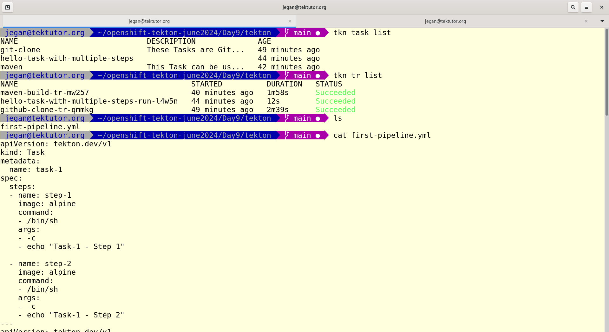
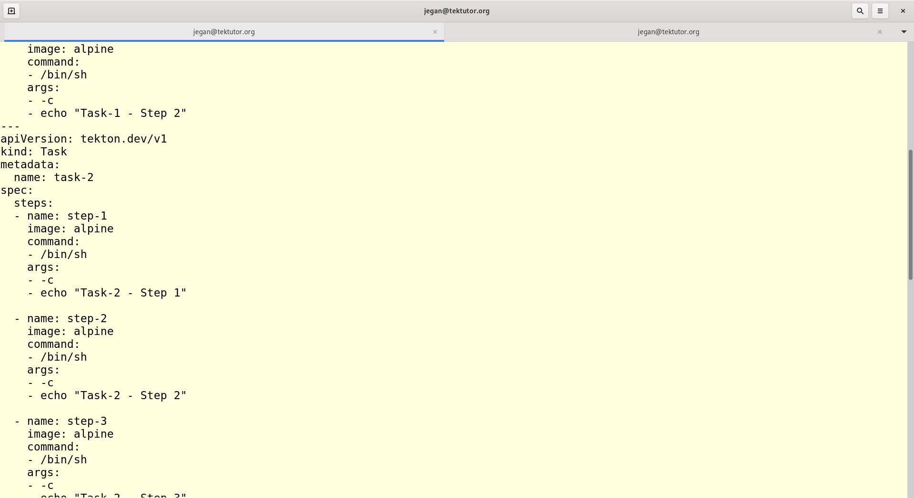
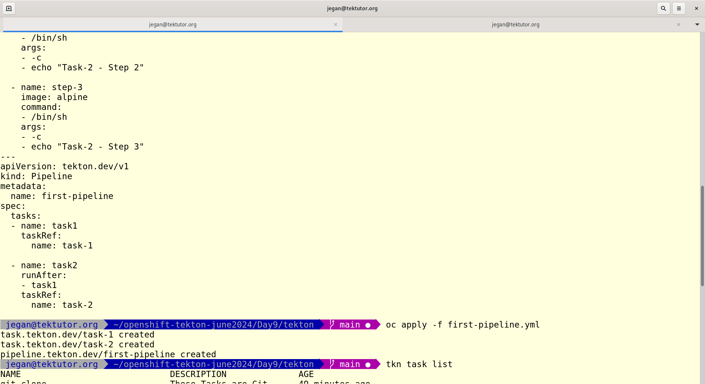
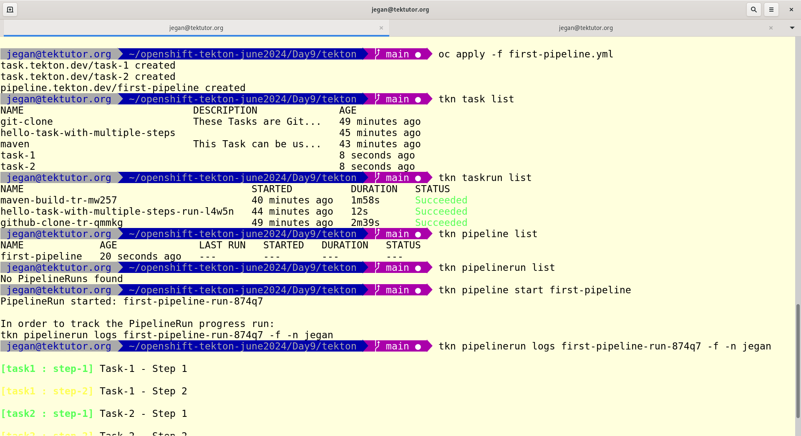
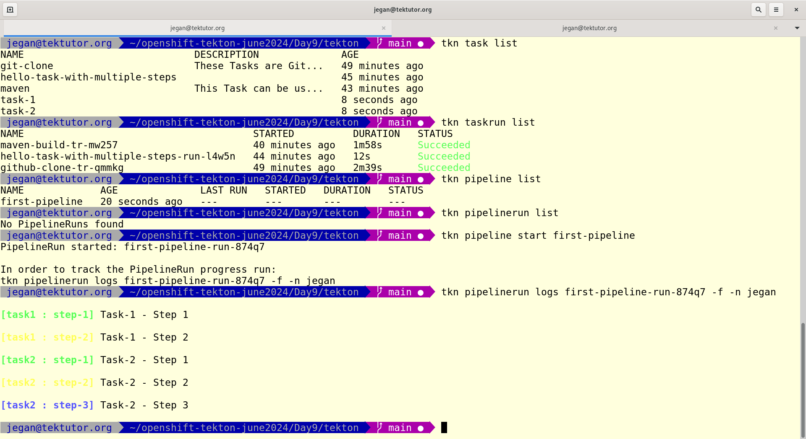
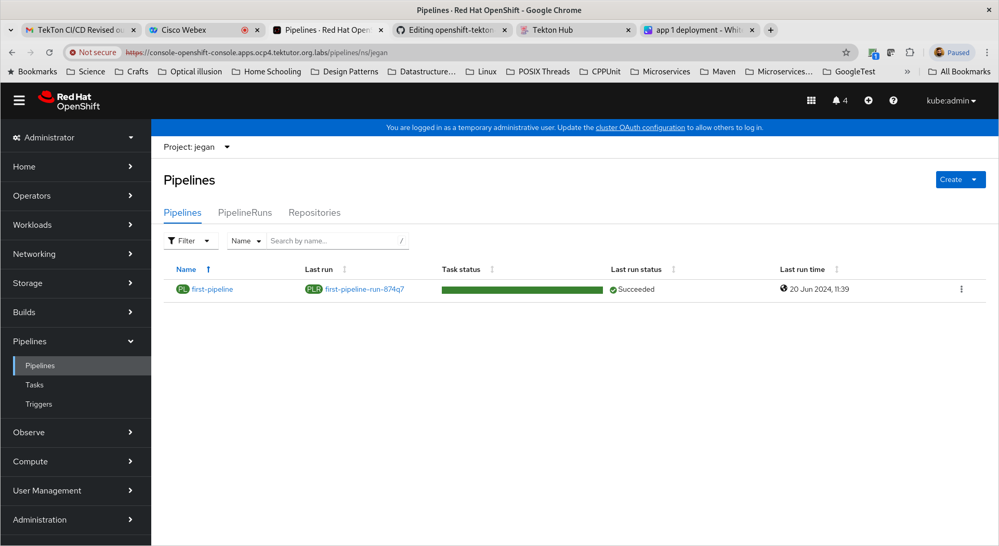
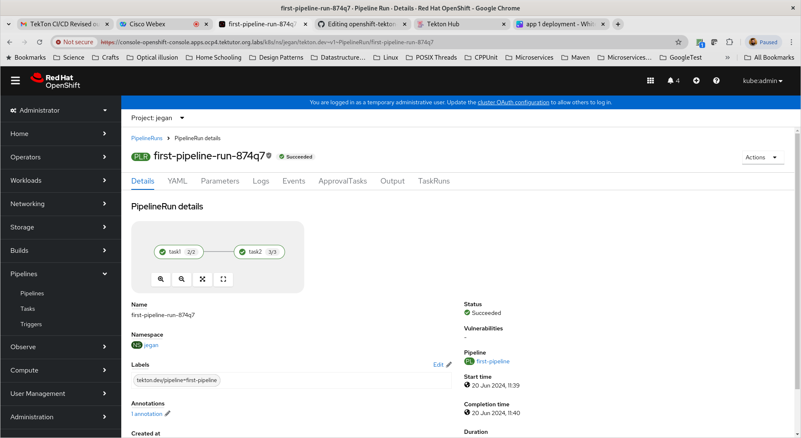
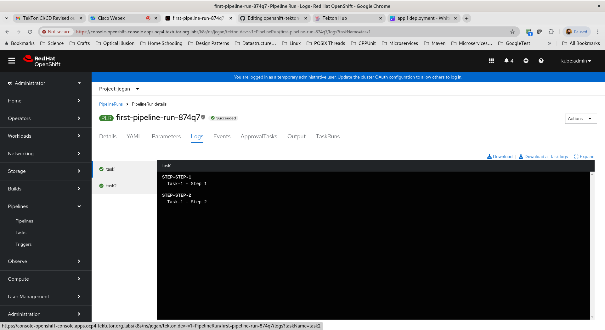
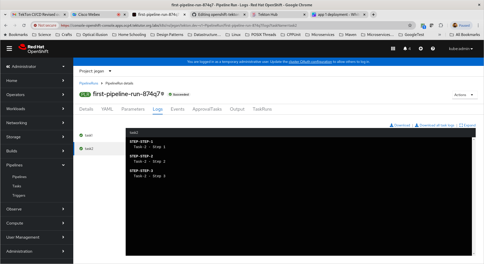
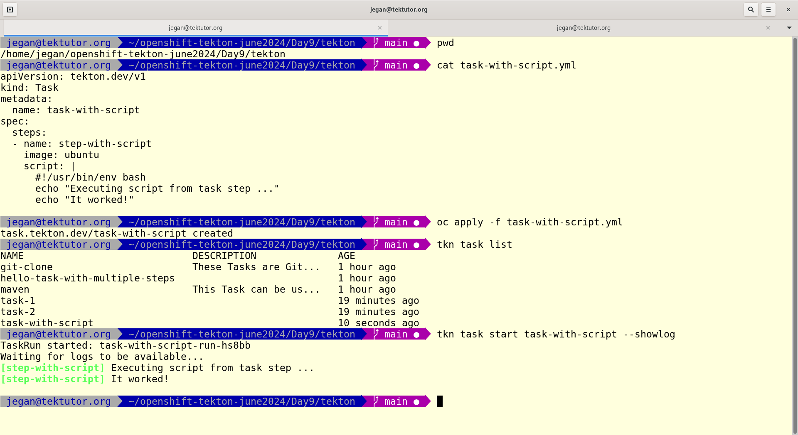

# Day 9

## Lab - Running a Tekton Maven Task
Install the git-clone and maven task from TekTon Hub website
```
tkn hub install task git-clone
tkn hub install task maven
```

List and check if you have installed the git-clone and maven tasks
```
tkn task list
```

Assuming you have already installed the git-clone and maven tasks from TekTon Hub. We can run the git-clone task
```
cd ~/openshift-tekton-june2024
git pull
cd Day8/tekton
oc project
oc create -f github-clone-taskrun.yml
```

Check the git-clone task status
```
tkn taskrun list
tkn taskrun logs -f github-clone-tr-qmmkg
```

Once the git-clone taskrun reports status as "SUCCEEDED", you can proceed with the maven task as shown below
```
cd ~/openshift-tekton-june2024
git pull
cd Day8/tekton
oc project
oc create -f maven-java-task.yml
```

Check the maven task status
```
tkn taskrun list
tkn taskrun logs -f maven-build-tr-mw257
```

Expected output


## Lab - Creating your first TekTon pipeline
```
cd ~/openshift-tekton-june2024
git pull
cd Day9/tekton

tkn task list
tkn taskrun list
tkn pipeline list
tkn pipelinerun list

oc apply -f first-pipline.yml

tkn task list
tkn taskrun list
tkn pipeline list
tkn pipelinerun list
```

Starting the first-pipeline
```
tkn pipeline start first-pipeline
```

Checking the logs
```
tkn pipelinerun logs -f first-pipeline-run-874q7
```

Expected output











## Lab - Running a script inside task
```
cd ~/openshift-tekton-june2024
git pull
cd Day9/tekton
cat task-with-script.yml
oc apply -f task-with-script.yml
tkn task list
tkn task start task-with-script --showlog
```

Expected output

